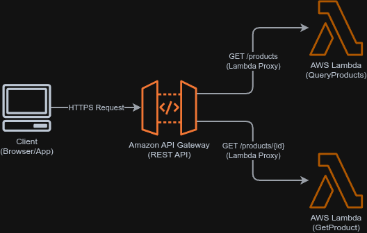

# Módulo 03 — Building Your First Serverless API

Detalhamento conceitual, técnico e prático do provisionamento do primeiro bloco do nosso e-commerce: o catálogo de produtos serverless.

---

## 01. Problema / Contexto
Para iniciar a operação de uma loja online, o catálogo de produtos precisa estar acessível de forma rápida e confiável para clientes via navegadores e aplicativos móveis. Sem uma API estruturada, as informações do inventário permanecem inacessíveis.

No entanto, o design tradicional dessa API enfrenta desafios críticos de engenharia:
1.  **Falta de Consistência (Click-Ops):** Configurar infraestrutura manualmente pelo console do provedor de nuvem impossibilita replicações idênticas em ambientes de homologação ou produção e gera desvios de configuração (*configuration drift*).
2.  **IaC de Baixa Confiabilidade:** Definir infraestrutura em linguagens dinâmicas ou templates brutos sem validações prévias faz com que erros simples (como typos em referências de recursos ou versões de runtimes incompatíveis) quebrem a aplicação no momento do deploy em nuvem.
3.  **Desperdício Financeiro (FinOps):** Requisições de segurança dos navegadores modernas (CORS Preflight - método `OPTIONS`) enviadas diretamente para processamento em código de funções serverless geram latência adicional ao cliente devido a *cold starts* e custos desnecessários de CPU/Memória por requisições vazias.

---

## 02. Objetivo
*   Desenvolver e implantar a primeira versão funcional da API de catálogo de produtos de forma **100% automatizada e reprodutível**.
*   Garantir **segurança de tipos em tempo de compilação** para a infraestrutura como código (IaC) utilizando o AWS CDK em Java 21.
*   Implementar testes de unidade automáticos (**Shift-Left Testing**) na infraestrutura para assegurar que os contratos de segurança e runtimes estejam corretos antes do deploy.
*   Mitigar latências de handshake e custos computacionais aplicando otimização nativa de CORS na camada de borda da API.

---

## 03. Solução
A arquitetura serverless foi construída utilizando o **AWS CDK v2** em **Java 21**, mapeando os seguintes recursos e integrações:



1.  **Amazon API Gateway (REST API):**
    *   **Recurso `/products`:** Mapeado ao método `GET` integrado via *Lambda Proxy Integration* à função de consulta geral.
    *   **Recurso `/products/{id}`:** Rota parametrizada mapeada ao método `GET` integrado à função de busca por ID.
    *   **CORS Nativo:** Aplicação global de `defaultCorsPreflightOptions` direto na especificação do API Gateway, interceptando requisições `OPTIONS` na borda e retornando as respostas CORS sem invocar códigos computacionais adicionais.
2.  **AWS Lambda Functions (Python 3.12):**
    *   `QueryProducts`: Extrai e processa parâmetros de query string (`queryStringParameters`) para listagem filtrada por categoria (ex: `?category=Electronics`).
    *   `GetProduct`: Extrai parâmetros de caminho (`pathParameters`) e busca dados de um produto específico, retornando tratamento padrão com status `404 Not Found` em caso de falha.
3.  **AWS IAM & CloudWatch Logs:**
    *   Políticas de privilégio mínimo geradas de forma declarativa e anexadas individualmente a cada função para gravação restrita de telemetria no CloudWatch.

---

## 04. Ferramentas

*   **Linguagem de Infraestrutura (IaC):** Java 21 (OpenJDK / Temurin)
*   **Linguagem de Computação (Lambdas):** Python 3.12 (Para otimização extrema de *Cold Starts*)
*   **Gerenciador de Build:** Gradle 9.3.0 (Kotlin DSL)
*   **Gerenciamento de SCA (Dependências):** Gradle Version Catalogs (`libs.versions.toml`)
*   **Biblioteca de Testes:** JUnit 5 integrado à biblioteca de asserções oficiais do AWS CDK (`assertions`)
*   **Serviços AWS:** Amazon API Gateway (REST), AWS Lambda, AWS IAM, Amazon CloudWatch

---

## 05. Resultado
O projeto foi testado e implantado com absoluto sucesso.

*   **Testes de Validação Local (Shift-Left):**
    As validações de estrutura de recursos e compatibilidade de runtimes foram executadas localmente via JUnit 5 em menos de **4 segundos**:
    ```bash
    ./gradlew test
    
    # Resultado esperado: BUILD SUCCESSFUL em 3.8s (2/2 testes aprovados)
    ```
*   **Deploy Automatizado:**
    A síntese gerou templates limpos e seguros do CloudFormation, e o provisionamento foi efetuado sem desvios:
    ```bash
    cdk synth  # Gera o arquivo CloudFormation em cdk.out/
    cdk deploy # Provisiona a infraestrutura de produção na região us-east-1
    ```
*   **Teste de Integração Real dos Endpoints:**
    ```bash
    API_URL="https://635106763014.execute-api.us-east-1.amazonaws.com/prod"
    
    # 1. Obter lista de todos os produtos (Status 200)
    curl "$API_URL/products"
    
    # 2. Buscar por ID existente (Status 200)
    curl "$API_URL/products/prod_001"
    
    # 3. Buscar com parâmetro de filtro (Status 200)
    curl "$API_URL/products?category=Electronics"
    
    # 4. Validar CORS Preflight (OPTIONS) nativo (Status 200 + Headers de Controle)
    curl -X OPTIONS "$API_URL/products" -v
    ```

---

## 06. Aprendizados & Troubleshooting (Maturidade Técnica)

Documentar as dificuldades e soluções adotadas demonstra a capacidade crítica de resolução de problemas reais (*troubleshooting*) sob pressão. Abaixo estão os principais marcos resolvidos nesta fase:

### 🧠 Troubleshooting 01: O Erro Oculto do Modo Silencioso do Gradle
*   **O Problema:** Durante a execução do CLI do CDK (ex: `cdk bootstrap`), o terminal falhava de forma obscura com o erro `ClassNotFoundException: com.petreca.MyCkdApp`.
*   **A Causa Raiz:** No arquivo `cdk.json`, a execução estava instruída como `./gradlew -q run`. O parâmetro `-q` (*quiet*) silenciava toda a saída de depuração e compilação do Gradle. Erros simples de importação ou pacotes inválidos quebravam a compilação local de forma silenciosa, impedindo a criação dos arquivos `.class` e induzindo ao erro de classe não encontrada.
*   **A Resolução:** Removi temporariamente o parâmetro `-q` para expor o fluxo de erro (`./gradlew run`) e passei a usar `./gradlew clean compileJava` como primeiro filtro de diagnóstico. Isso revelou imediatamente incompatibilidades de escrita nos pacotes Java, corrigidos de imediato na IDE.

### 🧠 Troubleshooting 02: Incompatibilidade de Artefato de Terceiros no Version Catalog
*   **O Problema:** O Gradle falhava na inicialização do script de compilação acusando a ausência do artefato `software.constructs:contructs:10.3.0`.
*   **A Causa Raiz:** Um erro sutil de digitação (*typo*) na definição de biblioteca no catálogo centralizado `gradle/libs.versions.toml`, onde o nome do artefato foi registrado como `contructs` (faltando a letra "s" interna).
*   **A Resolução:** Corrigi a linha correspondente no Version Catalog para `name = "constructs"`, limpei os caches locais do Gradle via terminal (`./gradlew --refresh-dependencies`) e sincronizei o ambiente Kotlin DSL no IntelliJ.

### 🧠 Troubleshooting 03: Falhas de Integração da Ponte JSII nos Testes locais (`JsiiError`)
*   **O Problema:** Os testes automatizados quebravam na linha `Code.fromAsset("lambda_code")` lançando uma exceção de interop do Node.js: `software.amazon.jsii.JsiiError`.
*   **A Causa Raiz:** O motor do AWS CDK roda sob JavaScript/Node.js e comunica-se com o Java por uma ponte RPC chamada JSII. Ao rodar os testes, o JUnit define o diretório de execução na raiz do módulo (`/serverless-api`). A ausência física ou renomeação da pasta `lambda_code` na raiz do projeto impedia que o motor do CDK empacotasse o asset, estourando a exceção do JSII.
*   **A Resolução:** Desenvolvi uma estrutura rígida garantindo a existência da pasta `lambda_code` contendo arquivos mock em formato Python no diretório raiz do projeto antes da execução dos testes JUnit, blindando o comportamento local e em futuras esteiras de CI/CD.

---

### 💸 Análise FinOps (Eficiência e Custos)
*   **Custo Estimado Mensal:** **$0.00** (100% elegível ao benefício do AWS Free Tier).
*   **Design de Baixo Custo:** Ao invés de criarmos uma rota extra de OPTIONS integrada à Lambda para lidar com CORS (como proposto em literaturas comuns), configuramos a resposta de CORS nativamente via **Mock Integration** no API Gateway.
*   **Impacto Prático:** Eliminamos 100% do tempo de processamento de Lambda para handshakes preliminares de navegadores. Isso protege o orçamento contra picos de tráfego que tentem forçar invocações abusivas da Lambda, reduzindo custos de computação (*Gigabytes-segundo*) a zero e neutralizando latências desnecessárias induzidas por *Cold Starts*.
