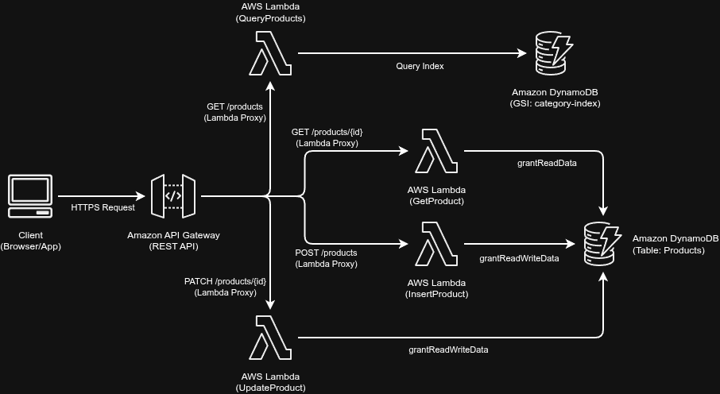

# Módulo 04 — Adding Data to Your API

Detalhamento conceitual, técnico e prático da introdução da camada de persistência de dados NoSQL resiliente, escalável e de altíssima performance no nosso e-commerce utilizando o Amazon DynamoDB.

---

## 01. Problema / Contexto
Funções serverless (como o AWS Lambda) são, por definição, *stateless* (sem estado). Isso significa que qualquer dado manipulado por elas desaparece assim que a execução termina. Para um catálogo de produtos real, precisamos de um mecanismo de persistência durável.

No entanto, o acoplamento de bancos de dados tradicionais a arquiteturas serverless gera gargalos severos de engenharia:
1.  **Gargalo de Conexões (Connection Pooling):** Bancos relacionais tradicionais (SQL) possuem um limite rígido de conexões simultâneas. Sob picos repentinos de acessos, centenas de instâncias concorrentes de funções Lambda podem esgotar instantaneamente o pool de conexões do banco, derrubando a API.
2.  **Maus Payloads na Camada de Persistência:** Permitir que payloads inválidos, incompletos ou maliciosos cheguem até o banco de dados desperdiça ciclos de processamento e recursos de armazenamento. Validar esses dados manualmente com condicionais `if/else` no código de negócio gera código frágil e de difícil manutenção.
3.  **Ambiente Local Poluído e Desorganizado (Developer Experience - DX):** Instalar pacotes externos do Python diretamente na raiz do código de produção das Lambdas polui a árvore do projeto com centenas de diretórios transitivos (como `pytest`, `boto3`, etc.), degradando a performance da IDE e dificultando o gerenciamento do Git.

---

## 02. Objetivo
*   Provisionar uma tabela de banco de dados NoSQL altamente disponível utilizando **Amazon DynamoDB** de forma declarativa via AWS CDK em Java 21.
*   Implementar a validação rígida de tipos e payloads na borda computacional (**Shift-Left Security**) com a biblioteca **Pydantic v2**.
*   Projetar uma camada de persistência isolada utilizando padrões de arquitetura limpa (**DAO/Repository Pattern**) em Python.
*   Isolar dependências físicas externas na pasta unificada `vendor` e mapeá-las na inicialização do runtime das Lambdas utilizando a variável de ambiente `PYTHONPATH`.
*   Validar o comportamento End-to-End (E2E) de escrita, leitura e atualização parcial atômica localmente via **LocalStack**.

---

## 03. Solução
A arquitetura de persistência e validação foi construída de forma desacoplada utilizando **AWS CDK v2** em **Java 21**:

<!-- TODO: Inserir Diagrama de Arquitetura do Draw.io aqui -->


1.  **Amazon DynamoDB (Tabela "Products"):**
    *   **Chave Primária Simples (Partition Key):** Atributo `id` do tipo `STRING`.
    *   **Índice Secundário Global (GSI):** Índice `category-index` com chave de partição `category` do tipo `STRING` para permitir buscas eficientes e indexadas sem a necessidade de realizar operações custosas de varredura global (`Scan`).
    *   **Modo de Tarifação:** Configurado como `PAY_PER_REQUEST` (On-Demand) para garantir escalabilidade infinita com custo zero em períodos de inatividade.
2.  **Isolamento de Dependências com `PYTHONPATH`:**
    *   Em vez de acoplar as dependências na pasta de código, o Pydantic foi instalado isoladamente no diretório `lambda_code/vendor/`.
    *   No CDK Java, foi injetada a variável de ambiente `"PYTHONPATH": "/var/task:/var/task/vendor"`, instruindo o runtime do Python na AWS a buscar os imports lá dentro sem misturar com o código de negócios.
3.  **Refatoração das Funções Lambda (Python 3.12):**
    *   `InsertProduct`: Valida a entrada de dados contra o schema Pydantic, gera um UUID v4 de forma atômica e persiste o item no DynamoDB (Verbo `POST`).
    *   `UpdateProduct`: Realiza a atualização parcial atômica utilizando expressões de atualização do DynamoDB (`UpdateExpression`), assegurando que apenas atributos válidos enviados no payload sejam alterados (Verbo `PATCH`).

---

## 04. Ferramentas

*   **Banco de Dados:** Amazon DynamoDB (NoSQL)
*   **Validador de Payload:** Pydantic v2 (isolado em `lambda_code/vendor`)
*   **Linguagem de Infraestrutura (IaC):** Java 21 (OpenJDK / Temurin)
*   **Linguagem de Computação (Lambdas):** Python 3.12
*   **Gerenciador de Build:** Gradle 9.3.0 (Kotlin DSL)
*   **Gerenciamento de SCA (Dependências):** Gradle Version Catalogs (`libs.versions.toml`)
*   **Emulador de Ambiente AWS:** LocalStack (v3+)

---

## 05. Resultado
O ambiente de persistência local foi provisionado e validado com absoluto sucesso.

*   **Deploy Limpo no LocalStack:**
    A síntese de infraestrutura em Java compilou perfeitamente e o deploy forçado foi concluído limpando qualquer cache antigo:
    ```bash
    ./gradlew clean build -x test
    rm -rf cdk.out/
    cdklocal deploy --force
    ```
*   **Teste Prático End-to-End (E2E) via Terminal:**

    **1. Inserir um Produto Válido (POST - HTTP 201 Created):**
    ```bash
    curl -k -X POST https://<ID_GATEWAY>.execute-api.localhost.localstack.cloud:4566/prod/products \
         -H "Content-Type: application/json" \
         -d '{
           "title": "Elixir de Gato",
           "category": "Home",
           "description": "Permite enxergar no escuro completo.",
           "price": 120.00
         }'
    
    # Retorno obtido com sucesso:
    # {"title": "Elixir de Gato", "category": "Home", "description": "Permite enxergar no escuro completo.", "price": 120, "id": "e3368f9c-7065-46f6-8ea4-3438f1d43115"}
    ```

    **2. Buscar o Produto Cadastrado por ID (GET - HTTP 200 OK):**
    ```bash
    curl -k -X GET https://<ID_GATEWAY>.execute-api.localhost.localstack.cloud:4566/prod/products/<ID_PRODUTO>
    
    # Retorno obtido com sucesso:
    # {"description": "Permite enxergar no escuro completo.", "id": "e3368f9c-7065-46f6-8ea4-3438f1d43115", "title": "Elixir de Gato", "category": "Home", "price": 120}
    ```

    **3. Atualizar Parcialmente o Produto (PATCH - HTTP 200 OK):**
    ```bash
    curl -k -X PATCH https://<ID_GATEWAY>.execute-api.localhost.localstack.cloud:4566/prod/products/<ID_PRODUTO> \
         -H "Content-Type: application/json" \
         -d '{
           "price": 150.00,
           "description": "Permite enxergar no escuro completo por 15 minutos."
         }'
    
    # Retorno obtido com sucesso (preço e descrição atualizados):
    # {"description": "Permite enxergar no escuro completo por 15 minutos.", "id": "e3368f9c-7065-46f6-8ea4-3438f1d43115", "category": "Home", "title": "Elixir de Gato", "price": 150}
    ```

---

## 06. Aprendizados & Troubleshooting (Maturidade Técnico-Operacional)

### 🧠 Troubleshooting 01: O Cache Obscuro de Assets do CDK (`cdk.out`)
*   **O Problema:** O LocalStack lançava repetidamente a exceção `Runtime.ImportModuleError: Unable to import module 'insert_product': No module named 'pydantic'`, mesmo após a pasta com as dependências do Pydantic ter sido criada no local correto.
*   **A Causa Raiz:** O AWS CDK realiza o hashing de diretórios locais para determinar se precisa reconstruir o ZIP de uma Layer ou Função. Se os metadados na pasta `cdk.out` indicarem que a pasta de asset não mudou de caminho, ele reaproveita silenciosamente o ZIP antigo (que estava vazio de dependências).
*   **A Resolução:** Adicionei a remoção agressiva da pasta `cdk.out/` (`rm -rf cdk.out/`) no script de deploy e passei a utilizar o parâmetro `--force` no `cdklocal deploy` para forçar o CDK a re-empacotar as dependências atualizadas.

### 🧠 Troubleshooting 02: Poluição de Dependências Transitivas no Workspace
*   **O Problema:** Executar comandos tradicionais de `pip install` na raiz de `lambda_code` instalava dependências transitivas de desenvolvimento (como `pytest` ou `testcontainers`), gerando dezenas de pastas indesejadas no VS Code e estourando o tamanho máximo permitido de ZIP na AWS.
*   **A Causa Raiz:** O instalador de dependências do Python (`pip`) joga todos os subpacotes na mesma raiz informada pelo argumento `-t`.
*   **A Resolução:** Adotei o padrão corporativo de **Vendor Folder**. Todas as dependências estritas de execução foram direcionadas para a pasta `lambda_code/vendor/`. O seu Git foi blindado ignorando essa pasta no `.gitignore` e a consistência em tempo de execução foi alcançada adicionando a pasta ao `PYTHONPATH` através do código Java do CDK.

### 🧠 Troubleshooting 03: Desvio Semântico em Verbos REST (PUT vs PATCH)
*   **O Problema:** A rota de alteração de produtos estava mapeada no API Gateway como `PUT`, mas a lógica interna aceitava payloads parciais opcionais.
*   **A Causa Raiz:** O método `PUT` na convenção REST é idempotente e semanticamente reservado para substituição total de um recurso (exige o envio de todo o payload do produto). O método correto para modificações parciais é o `PATCH`.
*   **A Resolução:** Alterei o método de mapeamento na classe `ProductApiStack.java` para `PATCH` e atualizei as definições globais de CORS do API Gateway para aceitarem e liberarem requisições usando este verbo de forma transparente.

---

### 💸 Análise FinOps (Persistência sob Controle)
*   **Billing Mode On-Demand (`PAY_PER_REQUEST`):** Diferente de bases relacionais clássicas (RDS) que cobram valores fixos por hora de servidor ativa (mesmo sem uso), o DynamoDB em modo On-Demand cobra apenas pelo volume real de leitura e escrita executado. Em ambiente de desenvolvimento e testes intermitentes, o custo mensal é mantido em exatos **$0.00**.
*   **Validação Antecipada (Pydantic):** A validação rápida de payload ocorre na borda computacional (AWS Lambda) antes de qualquer interação com a tabela física. Isso evita transações de leitura/escrita desnecessárias causadas por payloads corrompidos, economizando unidades de capacidade de escrita (WCUs) e otimizando custos em escala.