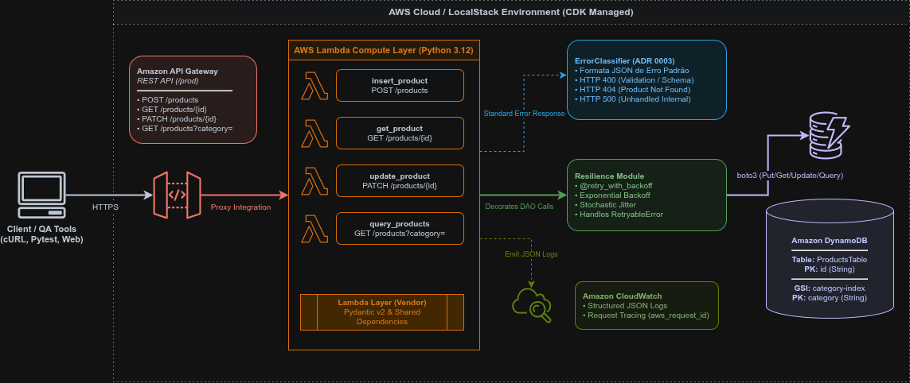

# Módulo 05 — Testing, Error Handling and Resiliency

Detalhamento conceitual, técnico e prático da implementação de resiliência, padronização de tratamento de erros na borda, refatoração em Clean Architecture e garantia de qualidade (QA) com testes unitários e de integração.

---

## 01. Problema / Contexto
Sistemas em produção que operam apenas sob a premissa do "caminho feliz" (*happy path*) sofrem de vulnerabilidades críticas quando expostos a falhas de rede, limites de taxa ou payloads corrompidos:

1. **Vazamento de Informações & Falta de Padronização:** Exceções não capturadas lançam respostas brutas HTTP `500 Internal Server Error` ou expõem *stack traces* internos da aplicação, violando princípios de segurança e dificultando a integração por aplicações consumidoras.
2. **Efeito Manada (*Thundering Herd*):** Falhas transitórias no banco de dados (como throttling no DynamoDB) tratadas com retentativas imediatas e desordenadas estressam a infraestrutura downstream, impedindo a recuperação do serviço.
3. **Código Monolítico e Defronte à Testabilidade:** Handlers misturando validação HTTP, lógica de persistência e tratamento de exceções tornam a escrita de testes unitários frágil e dependente do ecossistema da nuvem.

---

## 02. Objetivo
*   Refatorar a arquitetura computacional em Python aplicando princípios de **Clean Architecture** e separação estrita de responsabilidades (`handlers/`, `domain/`, `repository/`, `shared/`).
*   Implementar o contrato de erro padronizado definido na **ADR 0003** (`type`, `message`, `timestamp`, `request_id`, `suggestions`) para todas as exceções síncronas.
*   Construir um componente desacoplado de classificação de exceções (**`ErrorClassifier`**) e utilitários de resiliência com **Exponential Backoff e Jitter**.
*   Garantir alta cobertura de testes (Shift-Left Security) cobrindo:
    *   **Testes Unitários Python:** Validação de handlers, regras de validação do Pydantic v2 e exceções com Mocks (`pytest-mock` e `event_factory`).
    *   **Testes de Resiliência Python:** Validação isolada de algoritmos de retry e tratamento de timeouts intermitentes.
    *   **Testes de Integração Python:** Validação da camada DAO/Repository contra o DynamoDB via `Testcontainers` e infraestrutura em memória com `Moto`.
    *   **Testes de Infraestrutura Java:** Asserções de regras CDK via JUnit 5 e `software.amazon.awscdk.assertions.Template`.
*   Validar o comportamento End-to-End (E2E) localmente via **LocalStack** e provisionar com segurança na **AWS Cloud** usando o AWS CDK CLI.

---

## 03. Solução
A aplicação foi reestruturada para desacoplar a borda HTTP da camada de persistência e tratar falhas de forma preditiva:



1. **Contrato de Erro Padronizado (ADR 0003):**
   Todas as respostas de falha retornam uma estrutura JSON estrita contendo o `request_id` extraído do contexto do AWS Lambda, permitindo rastreabilidade no CloudWatch:
   ```json
   {
     "error": {
       "type": "product_not_found",
       "message": "Product with ID prod_123 was not found.",
       "request_id": "req-abc-123-xyz",
       "timestamp": "2026-07-19T21:00:00Z",
       "suggestions": ["Verifique se o ID informado na URL está correto."]
     }
   }
   ```
2. **Resiliência com Backoff Exponencial + Jitter (`shared/resilience.py`):**
   Decorador `@retry_with_backoff` aplicado a operações de banco de dados para retentar falhas temporárias (`RetryableError`) com tempos de espera crescentes acrescidos de variação estocástica (Jitter) para evitar colisões.
3. **Classificador Centralizado (`shared/error_handler.py`):**
   Componente encarregado de traduzir `ValidationError` (Pydantic), `ProductNotFoundError`, `DomainValidationError` e `Exception` genéricas para os respectivos códigos HTTP (`400`, `404`, `500`) com o payload JSON formatado.

---

## 04. Ferramentas

*   **Linguagem & Framework de Teste Computacional:** Python 3.12, Pytest, pytest-mock, Moto (DynamoDB Mock), Testcontainers (DynamoDB Local)
*   **Linguagem & Framework de Teste IaC:** Java 21, JUnit 5, AWS CDK Assertions
*   **Contêineres & Emulação Local:** Docker, LocalStack v3 (`cdklocal`)
*   **Ferramenta de Deploy e CLI:** AWS CDK CLI, AWS CLI v2

---

## 05. Validação Local & Cobertura de Testes

### 5.1. Suíte de Testes Automatizados (Shift-Left)

A suíte completa é composta por 21 testes cobrindo todas as camadas da aplicação:

**1. Testes Unitários do Runtime Python (Handlers, Pydantic & Error Handling):**
```bash
cd lambda_code
pytest tests/unit/
```
*   `test_get_product.py`: Testa busca com sucesso (200), ID ausente (400), falha de rede (500) e produto não encontrado (404 ADR 0003).
*   `test_insert_product.py`: Testa criação com UUID (201), preço negativo (400), body vazio (400), categoria inválida (400) e erro de sintaxe JSON (400).
*   `test_query_product.py`: Busca indexada via GSI (200), parâmetro de categoria ausente (400) e falha do GSI (500).
*   `test_update_product.py`: Atualização parcial (200), ID inexistente (404), schema inválido (400), ID ausente (400), body ausente (400) e JSON malformado (400).
*   `test_resilience.py`: Valida se o decorador intercepta falhas intermitentes (`RetryableError`), executa o número correto de retentativas e retorna sucesso.

**2. Testes de Integração do Repositório (Testcontainers + DynamoDB):**
```bash
pytest tests/integration/
```
*   `test_products_db_integration.py`: Sobe um container `amazon/dynamodb-local:1.25.0` via Docker e valida as chamadas físicas de `save`, `get_by_id` e montagem de `UpdateExpression` dinâmico do `PATCH`.

**3. Testes de Infraestrutura (Java CDK + JUnit 5):**
Na raiz do projeto:
```bash
./gradlew test
```
*   `ProductApiStackTest.java`: Valida a declaração da tabela DynamoDB, GSI `category-index`, instâncias do API Gateway e runtime Python 3.12 das Lambdas.

---

### 5.2. Teste de Integração End-to-End no LocalStack (`cdklocal`)

Para validar a orquestração de todos os recursos localmente via Docker sem custos de nuvem:

**1. Inicializar o LocalStack e Subir a Infraestrutura:**
```bash
localstack start -d

# Compilar o código Java do CDK e forçar deploy no LocalStack
./gradlew clean build -x test
rm -rf cdk.out/
cdklocal booststrap
cdklocal deploy
```

**2. Execução de Requisições de Teste via Terminal (`curl`):**

* **Cenário A: Sucesso na Criação (POST - HTTP 201 Created)**
  ```bash
  curl -k -X POST https://<API_ID>.execute-api.localhost.localstack.cloud:4566/prod/products \
       -H "Content-Type: application/json" \
       -d '{"title": "Espada de Prata", "category": "Home", "description": "Lâmina para monstros.", "price": 850.00}'
  ```

* **Cenário B: Erro de Validação de Payload (POST - HTTP 400 Bad Request)**
  ```bash
  curl -k -X POST https://<API_ID>.execute-api.localhost.localstack.cloud:4566/prod/products \
       -H "Content-Type: application/json" \
       -d '{"title": "Espada de Prata", "category": "Home", "description": "Lâmina para monstros.", "price": -50.00}'
  ```
  *Retorno obtido (Contrato ADR 0003):*
  
```json
{
  "error": {
    "type": "validation_error",
    "message": "1 validation error for ProductInput\nprice\n  Input should be greater than 0 [type=greater_than, input_value=-50.0, input_type=float]",
    "timestamp": "2026-07-20T01:55:12.398610Z",
    "request_id": "4471210c-a728-4291-b902-e1af94651db3",
    "details": {
      "validation_errors": [
        {
          "type": "greater_than",
          "loc": [
            "price"
          ],
          "msg": "Input should be greater than 0",
          "input": -50.0,
          "ctx": {
            "gt": 0.0
          },
          "url": "[https://errors.pydantic.dev/2.13/v/greater_than](https://errors.pydantic.dev/2.13/v/greater_than)"
        }
      ]
    },
    "suggestions": [
      "Corrija os parâmetros informados na requisição.",
      "Certifique-se de que nenhum campo obrigatório foi omitido."
    ]
  }
}
```

* **Cenário C: Produto Não Encontrado (GET - HTTP 404 Not Found)**
  ```bash
  curl -k -X GET https://<API_ID>.execute-api.localhost.localstack.cloud:4566/prod/products/prod_inexistente_999
  ```

---

## 06. Implantação e Validação na AWS Cloud

Após a validação nos testes locais, a infraestrutura é enviada para a nuvem real da AWS:

### 6.1. Deploy da Infraestrutura
```bash
cdk deploy
```

### 6.2. Teste de Rastreabilidade no CloudWatch
Execute uma chamada na URL pública do API Gateway gerada nos *Outputs*:

```bash
AWS_API_URL="https://<REST_API_ID>[.execute-api.us-east-1.amazonaws.com/prod](https://.execute-api.us-east-1.amazonaws.com/prod)"

curl -i "$AWS_API_URL/products/prod_witcher_invalid"
```

Copie o `request_id` retornado na resposta e consulte os logs diretamente no Amazon CloudWatch:

```bash
aws logs filter-log-events \
    --log-group-name "/aws/lambda/ProductApiStack-GetProductFunction" \
    --filter-pattern "<REQUEST_ID_OBTIDO>"
```

### 6.3. Destruição dos Recursos (FinOps)
Ao finalizar a validação em nuvem, destrua a stack para zerar custos de infraestrutura:
```bash
cdk destroy
```

---

## 07. Aprendizados & Troubleshooting (Maturidade Técnica)

### 🧠 Troubleshooting 01: Incompatibilidade de Serialização com Tipos `Decimal`
* **O Problema:** O `json.dumps()` nativo do Python falhava ao tentar serializar o objeto `Decimal` retornado pelo `boto3` nas respostas do DynamoDB.
* **A Resolução:** O `ErrorClassifier` e os utilitários de resposta foram ajustados para converter valores `Decimal` em `float`/`int` de forma transparente antes da serialização final em JSON.

### 🧠 Troubleshooting 02: Resolução de Pacotes no Pytest (`ModuleNotFoundError`)
* **O Problema:** O Pytest não localizava os pacotes `handlers`, `shared` e `repository` ao ser executado na raiz dos testes.
* **A Resolução:** Configuramos o `pytest.ini` em `lambda_code/` com `pythonpath = .` e `testpaths = tests`, garantindo a resolução automática dos módulos em qualquer ambiente ou esteira.

---

## 08. Análise FinOps & Resiliência

* **Economia por Interrupção na Borda:** Validações de payload e erros de sintaxe são interrompidos na borda da Lambda antes que qualquer chamada de I/O atinja o DynamoDB, preservando unidades de capacidade de leitura/escrita (RCUs/WCUs).
* **Proteção contra Thundering Herd:** O uso de Exponential Backoff com Jitter reduz significativamente a contenção e tentativas simultâneas durante picos de indisponibilidade intermitente do banco de dados.