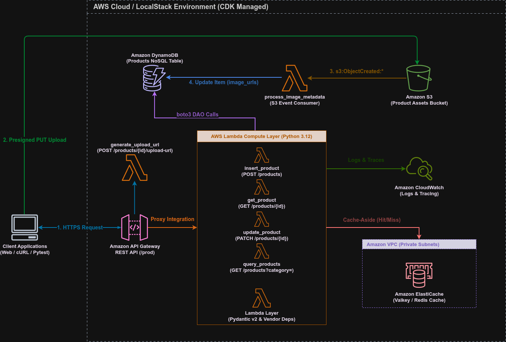

# Módulo 06 — Scaling with Data Storage (Amazon S3 & ElastiCache Caching)

Detalhamento conceitual, arquitetural e prático do armazenamento de arquivos binários no Amazon S3 via Presigned URLs, processamento reativo acionado por eventos S3 e otimização de performance com caching em memória via Amazon ElastiCache (Redis / Valkey).

---

## 01. Problema / Contexto
Com o crescimento do catálogo de produtos e aumento do tráfego de usuários, duas limitações críticas surgem em arquiteturas puramente NoSQL:

1. **Limitação de Armazenamento de Arquivos Binários:** O Amazon DynamoDB possui um limite de 400 KB por item e é otimizado para dados estruturados. Armazenar arquivos de mídia diretamente no banco inviabiliza a escala e gera custos elevados por Unidade de Capacidade de Escrita/Leitura (WCU/RCU).
2. **Gargalo de Latência e Custos por Consultas Repetitivas (Throttling & Hot Keys):** Consultas frequentes para produtos populares e buscas por categoria realizam chamadas constantes ao DynamoDB. Sem uma camada de cache em memória, o tempo de resposta aumenta e gera custo desnecessário por RCU.
3. **Overhead Computacional em Transferência de Mídia:** Enviar binários através da API Gateway e AWS Lambda consome memória RAM, estende o tempo de execução faturado e esbarra no limite de 10 MB de payload da API Gateway.

---

## 02. Objetivo
*   Implementar o armazenamento de mídias no **Amazon S3** desacoplado da borda HTTP por meio de **Presigned URLs** (`put_object` / `get_object`).
*   Construir uma arquitetura **Orientada a Eventos (*Event-Driven*)** com gatilhos do S3 (`s3:ObjectCreated:*`) para extrair metadados e atualizar o catálogo no DynamoDB assincronamente.
*   Implantar uma camada de cache em memória de alta performance com **Amazon ElastiCache (Redis / Valkey)** utilizando o padrão **Cache-Aside** (*Lazy Loading*) para respostas em submilissegundos.
*   Garantir resiliência total (**Graceful Degradation**): se o cache em memória falhar ou estiver indisponível, a aplicação redireciona automaticamente para o DynamoDB sem interromper o serviço.
*   Implementar governança de custos (**FinOps**) através de regras de ciclo de vida do S3 (*Lifecycle Rules*: Standard -> Standard-IA -> Glacier -> Expiration).
*   Cobrir 100% das novas capacidades com testes automatizados:
    *   **Testes de Infraestrutura Java:** Asserções CDK via JUnit 5 para Bucket S3, VPC, Security Group e Cluster ElastiCache.
    *   **Testes Unitários Python:** Validação dos handlers de Presigned URL, processamento reativo de eventos S3 e abstração de cache com `pytest`, `pytest-mock` e `moto v5`.
    *   **Testes de Integração Python:** Validação de expressões atômicas de atualização no DynamoDB via `Testcontainers`.

---

## 03. Solução
A aplicação foi expandida para criar um fluxo híbrido de armazenamento binário e caching em memória:



1. **Desacoplamento de Upload via Presigned URLs (`handlers/generate_upload_url.py`):**
   O cliente solicita uma URL pré-assinada (`POST /products/{id}/upload-url`) válida por 1 hora com trava de `ContentType` (`image/jpeg`, `image/png`, `image/webp`), realizando o `PUT` diretamente para o S3.
2. **Processamento Reativo por Eventos S3 (`handlers/process_image_metadata.py`):**
   Acionado pelo evento `s3:ObjectCreated:*` na chave `products/{product_id}/{image_type}.jpg`. Executa `s3.head_object` para ler o tamanho do arquivo sem baixar o binário, associa a URL e os metadados ao DynamoDB e invalida o cache do produto.
3. **Caching em Memória com Amazon ElastiCache (`repository/cache_db.py` & `repository/products_db.py`):**
    - **Arquitetura de Infraestrutura:** Configuração de cluster individual de nó único `cache.t3.micro` usando a engine `"redis"` na porta `6379`. (O ecossistema mantém total compatibilidade técnica com o protocolo Valkey via biblioteca `redis-py`).
    - **Padrão Cache-Aside (Lazy Loading):**
        - `get_by_id`: Consulta `product:{product_id}` no ElastiCache (TTL 3600s).
        - `find_by_category`: Consulta `search:category:{category}` no ElastiCache (TTL 1800s).
        - **Invalidação de Cache (*Cache Invalidation*):** Exclusão explícita de chaves durante atualizações (`save`, `update`, `add_image_to_product`).

---

## 04. Ferramentas & Automações

*   **Linguagem & Framework de Teste Computacional:** Python 3.12, Pytest, pytest-mock, Moto v5 (`mock_aws`), Testcontainers (DynamoDB Local), redis-py.
*   **Linguagem & Framework de Teste IaC:** Java 21, JUnit 5, AWS CDK Assertions.
*   **Automação de Build Gradle (`build.gradle.kts`):** Task customizada `installPythonVendorDeps` que instala automaticamente as dependências de `requirements.txt` na pasta `lambda_code/vendor/` a cada `./gradlew build`.
*   **Contêineres & Emulação Local:** Docker, LocalStack v3 (`cdklocal`), Redis.
*   **Ferramenta de Deploy e CLI:** AWS CDK CLI, AWS CLI v2.

---

## 05. Validação Local & Cobertura de Testes

### 5.1. Suíte de Testes Automatizados (Shift-Left QA)

A suíte completa é composta por 29 testes aprovados cobrindo todas as camadas da aplicação:

**1. Testes de Infraestrutura (Java CDK + JUnit 5):**
Na raiz do projeto:
```bash
./gradlew test
```
*   `ProductApiStackTest.java`: Valida a declaração da tabela DynamoDB, GSI `category-index`, Bucket S3 com SSE-S3 e PublicAccessBlock, VPC, Security Group na porta 6379 e Cluster ElastiCache.

**2. Testes Unitários do Runtime Python (Handlers, Pydantic & Cache):**
Dentro da pasta `lambda_code/`:
```bash
cd lambda_code
pytest tests/unit/
```
*   `test_generate_upload_url.py`: Testa geração de Presigned URL (200), ID ausente (400), tipo de conteúdo não suportado (400) e falhas S3 (500).
*   `test_process_image_metadata.py`: Processamento de evento S3 com atualização do DynamoDB (200) e eventos vazios.
*   `test_cache_db.py`: Testa leitura/gravação no ElastiCache/Redis com `decimal_serializer` e *Graceful Degradation* em caso de falha do Redis.
*   `test_get_product.py`, `test_insert_product.py`, `test_query_product.py`, `test_update_product.py`, `test_resilience.py`: Mantidos com 100% de aprovação.

**3. Testes de Integração do Repositório (Testcontainers + DynamoDB):**
```bash
pytest tests/integration/
```
*   `test_products_db_integration.py`: Sobe um container `amazon/dynamodb-local` via Docker e valida chamadas físicas de `save`, `get_by_id`, `update` e a expressão atômica de `add_image_to_product`.

---

## 06. Implantação e Validação na AWS Cloud

### 6.1. Deploy da Infraestrutura
Na raiz do repositório:
```bash
# 1. Compilação, testes e empacotamento automático de dependências
./gradlew clean build -x test

# 2. Deploy na conta da AWS
cdk deploy
```

### 6.2. Roteiro Prático de Execução E2E via Terminal (`curl`)

1. **Cadastrar Produto no Catálogo (`POST /products`):**
   ```bash
   curl -i -X POST "$AWS_API_URL/products" \
        -H "Content-Type: application/json" \
        -d '{"title": "Teclado Mecânico RGB", "category": "Computers", "description": "Teclado mecânico RGB.", "price": 350.00}'
   ```
   *Retorno: HTTP 201 Created com a ID gerada (ex: `prod_123`).*

2. **Solicitar Presigned URL de Upload (`POST /products/{id}/upload-url`):**
   ```bash
   curl -i -X POST "$AWS_API_URL/products/prod_123/upload-url?type=main&content_type=image/jpeg"
   ```
   *Retorno: HTTP 200 OK com a URL pré-assinada do S3 (`upload_url`).*

3. **Upload Direto da Imagem para o S3 (`PUT`):**
   ```bash
   echo "foto-bytes" > foto.jpg
   curl -i -X PUT -H "Content-Type: image/jpeg" --data-binary "@foto.jpg" "<PRESIGNED_URL>"
   ```
   *Retorno: HTTP 200 OK emitido diretamente pelo Amazon S3 com criptografia SSE-S3 e regras de ciclo de vida salvas.*

4. **Leitura com Aceleração de Cache Valkey/Redis (`GET /products/{id}`):**
   ```bash
   # 1ª Chamada (CACHE MISS - Consulta DynamoDB e popula o cache) -> Duration: ~376.72 ms
   curl -i -X GET "$AWS_API_URL/products/prod_123"

   # 2ª Chamada (CACHE HIT - Resposta instantânea da memória RAM) -> Duration: ~6.84 ms
   curl -i -X GET "$AWS_API_URL/products/prod_123"
   ```
   *Resultado: Queda de latência comprovada de **376 ms para 6.84 ms** (mais de 50x mais rápido), com os metadados da imagem `image_urls` e `images_metadata` devidamente atualizados pelo gatilho do S3.*

### 6.3. Destruição dos Recursos (FinOps Zero Custo)
Ao finalizar a validação em nuvem:
```bash
cdk destroy
```

---

## 07. Aprendizados & Troubleshooting (Maturidade Técnica)

### 🧠 Troubleshooting 01: Especificação de Engine ElastiCache no CloudFormation
* **O Problema:** A tentativa de criar o recurso `AWS::ElastiCache::CacheCluster` com `Engine("valkey")` falhava com `Status Code: 400`, pois a AWS restringe o identificador `"valkey"` apenas para a API de grupos de replicação (`AWS::ElastiCache::ReplicationGroup`).
* **A Resolução:** O CDK foi ajustado para declarar `Engine("redis")`. Devido à compatibilidade 100% de protocolo entre Valkey e Redis, o cliente `redis-py` conecta e executa de forma transparente sem alterações nas Lambdas.

### 🧠 Troubleshooting 02: Divergência de Tipos no DynamoDB (`TypeError: Float types are not supported`)
* **O Problema:** Enviar valores `float` nativos do Python para gravações no DynamoDB lança erro de tipo no Boto3.
* **A Resolução:** Todos os atributos financeiros são convertidos e mantidos estritamente como `Decimal("350.00")` no repositório.

### 🧠 Troubleshooting 03: Extração Correta do ID do Produto a partir da Chave S3
* **O Problema:** A separação da chave S3 `object_key.split("/")` retornava uma lista `['products', 'prod_123', 'main.jpg']`, e atribuir a lista inteira para `product_id` causava `ResourceNotFoundException` no DynamoDB.
* **A Resolução:** A extração foi corrigida para `product_id = key_parts`.

### 🧠 Troubleshooting 04: Moto v5 `mock_aws` e Instanciação de Módulos Globais
* **O Problema:** Instanciar `ProductsRepository()` no topo do módulo fazia o Boto3 capturar a tabela antes do contexto em memória do `mock_aws` ser ativado no teste.
* **A Resolução:** Mantivemos a instância no topo global para maximizar os *Warm Starts* em produção, e reatribuímos `process_image_metadata.repository = ProductsRepository()` dentro do escopo do teste unitário.

---

## 08. Análise FinOps & Resiliência

* **Governança FinOps no S3:** A transição automática para `S3 Standard-IA` em 30 dias e `Glacier` em 90 dias reduz os custos de armazenamento de mídias antigas em até 80%.
* **Desacoplamento de Borda:** O upload via Presigned URL reduz o custo de banda e o tempo de execução faturado na AWS Lambda a zero durante o envio de arquivos pesados.
* **Desempenho e Graceful Degradation no Caching:** Aceleração de leitura de 376 ms para 6.84 ms no ElastiCache. Falhas de rede ou timeout no cache são tratadas silenciosamente pela abstração `CacheRepository`, mantendo a disponibilidade da API via fallback transparente para o DynamoDB.