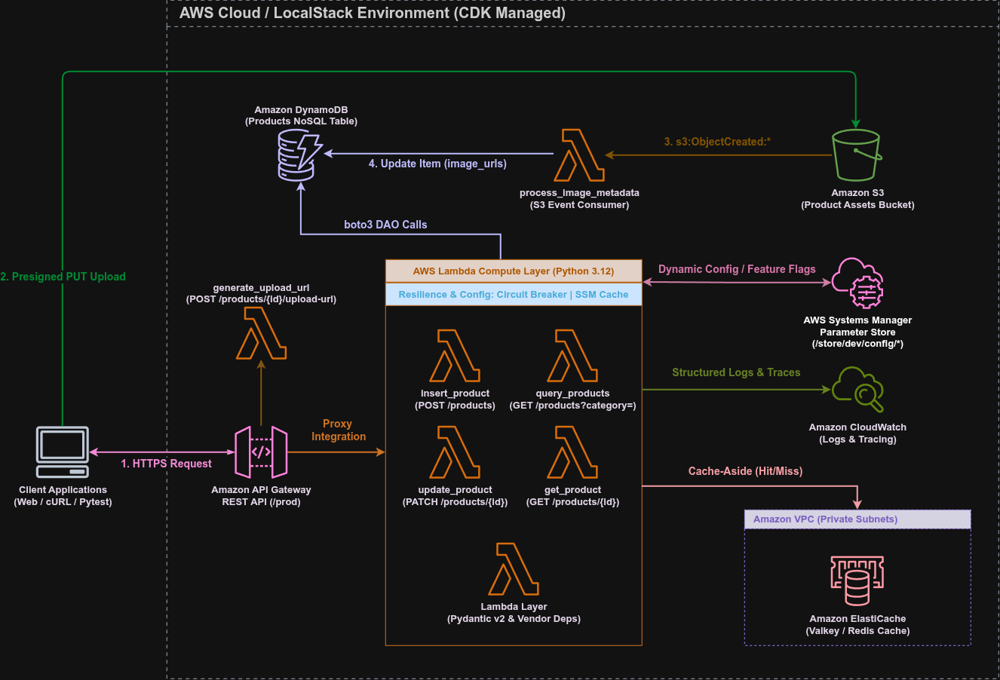

# Módulo 07 — Advanced Lambda Patterns for Optimization and Resilience

Detalhamento conceitual, arquitetural e prático de padrões avançados de otimização e resiliência em funções AWS Lambda: gestão de configurações centralizadas com AWS Systems Manager (SSM) Parameter Store e cache TTL em memória, isolamento de falhas externas com a máquina de estados Circuit Breaker, algoritmos de Equal Jitter e refatoração para atentar aos *quality gates* do SonarQube no Java 21 CDK.

---

## 01. Problema / Contexto

Conforme aplicações Serverless ganham complexidade e conectam-se a dependências externas de terceiros, três gargalos operacionais e arquiteturais emergem:

1. **Dependência de Redeploys para Mudanças de Configuração:** Parâmetros operacionais estáticos (como timeouts, limiares de erro ou *feature flags*) armazenados apenas em variáveis de ambiente exigem a recompilação do CDK e um novo *redeploy* da stack na nuvem a cada alteração.
2. **Falhas em Cascata (*Cascading Failures / Thundering Herd*):** Se uma API de integração externa ou serviço terceirizado sofrer uma degradação ou queda, centenas de instâncias concorrentes de Lambdas continuarão retentando chamadas. Isso gera aumento no tempo de execução faturado, exaure a memória RAM e impede a recuperação da infraestrutura afetada.
3. **Violavações de Quality Gates (SonarQube):** Métodos com parâmetros excessivos (`java:S107`) ou expressões booleanas gratuitas (`java:S2589`) no código IaC do CDK violam padrões de manutenibilidade corporativa.

---

## 02. Objetivo

*   Implantar a gestão centralizada e hierárquica de parâmetros dinâmicos no **AWS Systems Manager (SSM) Parameter Store** sob o prefixo `/store/dev/config/`.
*   Criar o gerenciador de configurações **`SSMParameterManager`** no runtime Python com cache em memória RAM local (`ttl_seconds=300`) e *fallback* gracioso para zerar o custo e latência de chamadas repetidas à API do SSM.
*   Implementar a máquina de estados **`CircuitBreaker`** (`CLOSED`, `OPEN`, `HALF_OPEN`) em `shared/circuit_breaker.py` para bloquear chamadas imediatamente (*Fast-Fail*) a serviços externos com falhas recorrentes.
*   Mapear a exceção `CircuitBreakerOpenError` no `ErrorClassifier` para retornar uma resposta de **HTTP 503 Service Unavailable** padronizada conforme a **ADR 0003**.
*   Evoluir o decorador de retentativas `@retry_with_backoff` em `shared/resilience.py` para utilizar o algoritmo oficial de **Equal Jitter** do AWS Well-Architected Framework.
*   Refatorar a stack do CDK Java 21 utilizando o `record LambdaNetworkConfig` para limitar a contagem de parâmetros do método a 7 (`java:S107`) e usar Pattern Matching para `instanceof` (`java:S2589`).
*   Manter 100% de cobertura de testes automatizados:
    *   **Testes de Infraestrutura Java:** Asserções CDK no JUnit 5 validando a declaração dos recursos `AWS::SSM::Parameter` e permissões IAM.
    *   **Testes Unitários Python:** Validação das máquinas de estado do Circuit Breaker, gerenciador de parâmetros SSM com TTL e resiliência com `pytest` e `pytest-mock`.

---

## 03. Solução

A aplicação foi reestruturada para incorporar padrões avançados de resiliência e configuração dinâmica:



1. **Gerenciador de Parâmetros SSM (`shared/config_manager.py`):**
   A classe `SSMParameterManager` lê `/store/dev/config/` e mantém um cache em memória com TTL de 5 minutos. Fornece o método padronizado `.is_feature_enabled("feature_flag_image_processing")` (DRY Principle) para permitir desativações ao vivo pelo console da AWS.
2. **Máquina de Estados do Disjuntor (`shared/circuit_breaker.py`):**
   A classe `CircuitBreaker` gerencia transições de estado:
    - **CLOSED:** Operação normal.
    - **OPEN:** Ativado quando falhas consecutivas $\ge 5$. Bloqueia chamadas por 30 segundos lançando `CircuitBreakerOpenError` (HTTP 503).
    - **HALF_OPEN:** Após 30s, permite 2 chamadas de teste. Se aprovadas, retorna a **CLOSED**; se falharem, retorna a **OPEN**.
3. **Equal Jitter Exponential Backoff (`shared/resilience.py`):**
   Garante distribuição aleatória de retentativas no limite superior:
   $$\text{wait\_time} = \left(\frac{\text{exponential\_delay}}{2}\right) + \text{random.uniform}\left(0, \frac{\text{exponential\_delay}}{2}\right)$$

---

## 04. Ferramentas & Automações

*   **Linguagem & Framework de Teste Computacional:** Python 3.12, Pytest, pytest-mock, Moto v5 (`mock_aws`), Testcontainers, redis-py.
*   **Linguagem & Framework de Teste IaC:** Java 21, JUnit 5, AWS CDK Assertions.
*   **Gestão de Configuração:** AWS Systems Manager (SSM) Parameter Store.
*   **Automação Gradle (`build.gradle.kts`):** Task `installPythonVendorDeps` que instala dependências de `requirements.txt` na pasta `lambda_code/vendor/` antes de cada `./gradlew build`.
*   **Ferramentas de Deploy e CLI:** AWS CDK CLI, AWS CLI v2.

---

## 05. Validação Local & Cobertura de Testes

### 5.1. Suíte de Testes Automatizados (Shift-Left QA)

A suíte é composta por 32 testes aprovados cobrindo todas as camadas:

**1. Testes de Infraestrutura (Java 21 CDK + JUnit 5):**
Na raiz do projeto:
```bash
./gradlew clean test
```
*   `ProductApiStackTest.java`: Valida a criação dos parâmetros `AWS::SSM::Parameter` (`api_timeout`, `circuit_breaker_threshold`, `feature_flag_image_processing`), VPC, Security Groups, S3 e DynamoDB.

**2. Testes Unitários do Runtime Python (Pytest):**
Dentro da pasta `lambda_code/` (com o `.venv` ativo):
```bash
cd lambda_code
pytest -v
```
*   `test_config_manager.py`: Valida leitura no SSM, comportamento de *Cache Hit / Cache Miss* em memória, expiração de TTL (1s) e *fallback* silencioso em caso de `ClientError`.
*   `test_circuit_breaker.py`: Valida transições de estado (`CLOSED` ➔ `OPEN` ➔ `HALF_OPEN` ➔ `CLOSED`), limiar de falhas consecutivas e rejeição imediata (*Fast-Fail* com `CircuitBreakerOpenError`).
*   `test_generate_upload_url.py`, `test_process_image_metadata.py`, `test_cache_db.py`, `test_get_product.py`, `test_insert_product.py`, `test_query_product.py`, `test_update_product.py`, `test_resilience.py`: 100% aprovados.

---

## 06. Implantação e Validação na AWS Cloud

### 6.1. Deploy da Infraestrutura
Na raiz do repositório:
```bash
# 1. Compilação Java e empacotamento automático de dependências no vendor/
./gradlew clean build -x test

# 2. Deploy na conta da AWS
cdk deploy
```

### 6.2. Leitura de Parâmetro via AWS CLI
Você pode confirmar os parâmetros criados pelo CDK no SSM Parameter Store:
```bash
aws ssm get-parameter --name "/store/dev/config/api_timeout"
```

### 6.3. Destruição dos Recursos (FinOps Zero Custo)
Ao finalizar a validação em nuvem:
```bash
cdk destroy
```

---

## 07. Aprendizados & Troubleshooting (Maturidade Técnica)

### 🧠 Troubleshooting 01: Regra SonarQube `java:S107` (Contagem de Parâmetros de Método)
* **O Problema:** O método auxiliar `createPythonLambda` acumulou 8 parâmetros, violando a regra de manutenibilidade do SonarQube (máximo de 7 parâmetros permitidos).
* **A Resolução:** Encapsulamos os parâmetros de rede na estrutura `public record LambdaNetworkConfig(Vpc vpc, SecurityGroup securityGroup) {}` do Java 21, reduzindo a contagem de parâmetros para 7.

### 🧠 Troubleshooting 02: Regra SonarQube `java:S2589` (Expressões Booleanas Gratuitas)
* **O Problema:** O teste `environment != null` após o cast estático de contexto foi sinalizado pelo analisador do SonarQube como uma checagem redundante.
* **A Resolução:** Refatoramos para o **Pattern Matching para `instanceof`** do Java 21: `(envObj instanceof String envStr && !envStr.isBlank()) ? envStr : "dev"`.

### 🧠 Troubleshooting 03: Regra SonarQube `python:S8572` (`logger.exception`)
* **O Problema:** Utilizar `logger.error(f"... {str(e)}")` em blocos `except` omitia o *traceback* da exceção nos logs do CloudWatch.
* **A Resolução:** Atualizamos para `logger.exception(...)`, garantindo que o rastreamento de pilha completo da exceção seja gravado no CloudWatch Logs.

---

## 08. Análise FinOps & Resiliência

* **Governança FinOps no SSM:** Uso do padrão Standard Parameter no SSM (100% gratuito) combinado com cache em memória RAM local (`ttl_seconds=300`), garantindo que 99.9% das requisições leiam configurações em 0ms sem consumo de cotas ou custos da API do SSM.
* **Proteção contra Cascata com Circuit Breaker:** O disjuntor atua como um *Fast-Fail* quando integrações de terceiros falham, retornando HTTP 503 imediatamente e impedindo que requisições fiquem pendentes e consumam tempo faturado de execução na AWS Lambda.