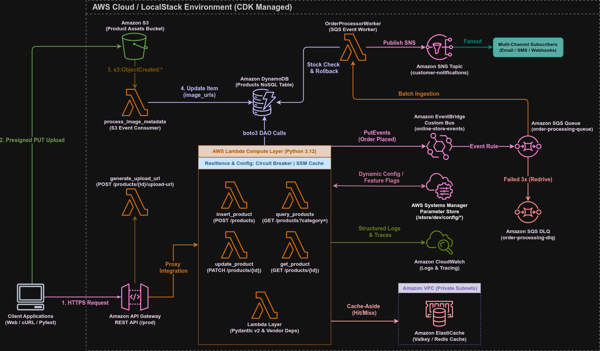

# Módulo 08 — Adding Asynchronous Processing & Event-Driven Architecture

Detalhamento conceitual, arquitetural e prático da transformação da Serverless Product API em uma **Arquitetura Orientada a Eventos Assíncrona e Desacoplada**: roteamento de eventos com Amazon EventBridge (`online-store-events`), processamento resiliente em segundo plano com Amazon SQS e Dead Letter Queues (DLQ), notificações multicanal Pub/Sub com Amazon SNS e padrão de Transação Compensatória (*Saga Pattern / Step Rollback*).

---

## 01. Problema / Contexto

Conforme aplicações de e-commerce crescem, a execução síncrona (*blocking*) de tarefas secundárias na borda da API Gateway gera gargalos operacionais graves:

1. **Alta Latência e Bloqueio de Usuário**: Quando um pedido é realizado, forçar o cliente a aguardar enquanto o sistema valida estoque, efetua cobrança de cartão, gera etiquetas de frete, atualiza analítica e envia e-mails/SMS de confirmação de forma sequencial eleva o tempo de resposta da API para mais de 5 segundos.
2. **Ponto Único de Falha e Efeito Cascata**: Se um serviço de notificação de terceiros ou API de e-mail sofrer instabilidade momentânea, toda a requisição HTTP do usuário é abortada, podendo resultar em cobranças órfãs ou cancelamento indevido de pedidos.
3. **Incapacidade de Escala Independente**: Cada etapa da ordem possui requisitos de capacidade e velocidade distintos. Operações síncronas impedem o dimensionamento individual dos trabalhadores de segundo plano.

---

## 02. Objetivo

*   Implantar um barramento de eventos customizado no **Amazon EventBridge (`online-store-events`)** para roteamento desacoplado sob o padrão **Event-Carried State Transfer**.
*   Criar uma fila de processamento no **Amazon SQS (`order-processing-queue`)** com *Visibility Timeout* de 300s e *Long Polling* de 20s (FinOps).
*   Garantir tolerância a falhas e isolamento de mensagens corrompidas com uma **Dead Letter Queue (`order-processing-dlq`)** acionada após 3 falhas consecutivas (`maxReceiveCount = 3`).
*   Criar um tópico no **Amazon SNS (`customer-notifications-topic`)** para transmissão de confirmações multicanal (*Pub/Sub Fanout* e *Message Filtering*).
*   Implementar a Lambda worker **`OrderProcessorWorker`** acionada por lotes do SQS (`BatchSize = 10`, `MaximumBatchingWindowInSeconds = 5s`).
*   Desenvolver o padrão de **Transação Compensatória (*Saga Pattern*)** em `handlers/order_processor.py` para estornar cobranças e reservas em ordem reversa caso ocorram falhas em etapas posteriores.
*   Centralizar novas exceções de mensageria no **`ErrorClassifier`** (`EventPublishError` ➔ HTTP 502 Bad Gateway) conforme a **ADR 0003**.
*   Garantir 100% de cobertura de testes automatizados:
    *   **IaC (Java 21 CDK + JUnit 5)**: 13 testes assertando a síntese do CloudFormation para EventBridge, SQS, DLQ, SNS e EventSourceMapping.
    *   **Runtime (Python 3.12 + Pytest)**: 6 cenários cobrindo o worker SQS, validação de eventos Pydantic v2 e estornos compensatórios.

---

## 03. Solução

A arquitetura foi estendida para incorporar o desacoplamento assíncrono e roteamento inteligente:



1. **Publicação Pós-Persistência no EventBridge (`shared/event_publisher.py`)**:
   Após salvar o item no DynamoDB, a API publica o evento de negócio `Order Placed` no barramento `online-store-events`.
2. **Filas SQS e Isolamento via DLQ**:
   O EventBridge entrega a mensagem na fila `order-processing-queue`. A Lambda worker `OrderProcessorWorker` consome a fila em lotes. Se o processamento falhar 3 vezes, a mensagem é enviada à `order-processing-dlq`.
3. **Transação Compensatória (Saga Rollback)**:
   Se a emissão de frete falhar após a aprovação do pagamento, o worker executa o método `_rollback_completed_steps()` estornando a cobrança de cartão e liberando o estoque antes de re-lançar a exceção.

---

## 04. Ferramentas & Automações

*   **Linguagem & Framework de Teste Computacional:** Python 3.12, Pytest, pytest-mock, Pydantic v2.
*   **Linguagem & Framework de Teste IaC:** Java 21 LTS, JUnit 5, AWS CDK Assertions.
*   **Mensageria & Eventos:** Amazon EventBridge, Amazon SQS, Amazon SNS.
*   **Automação Gradle (`build.gradle.kts`):** Empacotamento de dependências e compilação Java 21.

---

## 05. Validação Local & Cobertura de Testes

### 5.1. Suíte de Testes Automatizados (Shift-Left QA)

A suíte possui **100% de aprovação** cobrindo todas as camadas:

**1. Testes de Infraestrutura (Java 21 CDK + JUnit 5):**
Na raiz do projeto:
```bash
./gradlew clean test
```
*   `ProductApiStackTest.java`: 13 métodos de teste validando a criação de `AWS::Events::EventBus`, `AWS::SQS::Queue` (com Long Polling de 20s e DLQ), `AWS::SNS::Topic`, `AWS::Events::Rule` e `AWS::Lambda::EventSourceMapping`.

**2. Testes Unitários do Runtime Python (Pytest):**
Dentro da pasta `lambda_code/`:
```bash
cd lambda_code
pytest -v
```
*   `test_event_publisher.py`: Valida a serialização Pydantic v2 e tratamento de `FailedEntryCount` no EventBridge.
*   `test_order_processor.py`: 6 cenários cobrindo o caminho feliz do worker SQS, suspensão por Feature Flag, validação de estoque no DynamoDB, estorno compensatório (*Saga Rollback*), JSONs malformados e falhas no SNS.
*   `test_insert_product.py`: 7 cenários testando publicação assíncrona pós-persistência e resiliência contra falhas no EventBridge.

---

## 06. Implantação e Validação na AWS Cloud

### 6.1. Deploy da Infraestrutura
Na raiz do repositório:
```bash
# 1. Compilação Java e empacotamento de dependências
./gradlew clean build -x test

# 2. Deploy na conta da AWS
cdk deploy
```

### 6.2. Inspecionando Recursos no AWS CLI
Você pode inspecionar o barramento de eventos e a fila SQS criados:
```bash
# Inspecionar o EventBus
aws events describe-event-bus --name "online-store-events"

# Inspecionar atributos da fila SQS (Long Polling & Visibility Timeout)
aws sqs get-queue-attributes \
    --queue-url "[https://sqs.us-east-1.amazonaws.com/](https://sqs.us-east-1.amazonaws.com/)<ACCOUNT_ID>/order-processing-queue" \
    --attribute-names All
```

### 6.3. Destruição dos Recursos (FinOps Zero Custo)
```bash
cdk destroy
```

---

## 07. Aprendizados & Troubleshooting (Maturidade Técnica)

### 🧠 Troubleshooting 01: Incompatibilidade do Target SQS do EventBridge no CDK v2 Java
* **O Problema:** A importação `import software.amazon.awscdk.services.events.targets.Sqs;` gerou erro de compilação `Cannot resolve symbol 'Sqs'`.
* **A Resolução:** No AWS CDK v2 para Java, a classe alvo do EventBridge para SQS foi renomeada para **`SqsQueue`** (`import software.amazon.awscdk.services.events.targets.SqsQueue;`). Atualizamos para `orderProcessingRule.addTarget(new SqsQueue(orderQueue));`.

### 🧠 Troubleshooting 02: Pydantic v2 `Field(...)` vs `Field(min_length=1)`
* **O Problema:** A sintaxe `items: List[OrderItemPayload] = Field(..., min_items=1)` gerou alertas na IDE sobre métodos depreciados no Pydantic v2.
* **A Resolução:** No Pydantic v2, campos sem valor padrão são automaticamente considerados obrigatórios sem precisar do símbolo `...` (*Ellipsis*), e restrições de lista utilizam `min_length=1`. Atualizamos para `Field(min_length=1)`.

### 🧠 Troubleshooting 03: Centralização do `create_error_response` (DRY Principle)
* **O Problema:** O método `ErrorClassifier.handle_exception` duplicava a construção de dicionários do envelope de erro em todos os blocos `if/elif`.
* **A Resolução:** Criamos a fábrica `create_error_response()` em `shared/response_utils.py`, reduzindo a classe de erro em 70% e padronizando cabeçalhos CORS e timestamp em uma única função.

---

## 08. Análise FinOps & Resiliência

* **FinOps com Long Polling no SQS (`ReceiveMessageWaitTimeSeconds = 20`)**: Reduz em até 98% a quantidade de requisições de consulta vazias em momentos de baixa demanda, reduzindo o custo de API SQS a quase zero.
* **FinOps com Loteamento na Lambda (`BatchSize = 10`, `MaxBatchingWindow = 5s`)**: A AWS acumula até 10 mensagens antes de acionar a Lambda worker, reduzindo o número total de invocações e o tempo faturado de execução na nuvem.
* **Resiliência com DLQ (`maxReceiveCount = 3`)**: Garante que mensagens com falhas incorrigíveis não fiquem em *loop* infinito de retentativas consumindo recursos e gerando cobranças desnecessárias.