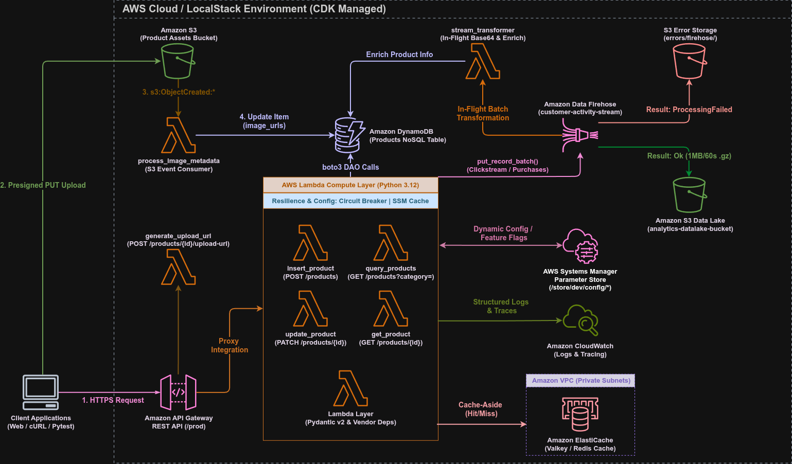

# Módulo 09 — Real-time Data Streaming with Amazon Data Firehose and Lambda Transformations

Detalhamento conceitual, arquitetural e prático do pipeline de **Real-Time Data Streaming** da Serverless Product API: ingestão de fluxos contínuos de atividades dos clientes com **Amazon Data Firehose**, transformação em voo (*In-Flight Transformation*) e enriquecimento de dados via **AWS Lambda**, filtragem de ruído, compressão **GZIP** e armazenamento gerenciado no **Amazon S3 Analytics Data Lake**.

---

## 01. Problema / Contexto

Conforme plataformas de e-commerce ganham volume de tráfego, duas limitações críticas surgem em abordagens tradicionais de dados:

1. **Atraso Analítico no Processamento em Lote (*Batch Processing*)**: Coletar logs e métricas durante o dia para processamento noturno impede a geração de recomendações personalizadas ao vivo, dashboards de BI em tempo real ou detecção instantânea de comportamento suspeito.
2. **Custo Elevado por I/O no Banco NoSQL**: Gravar eventos de clique (*clickstreams*) de alto volume diretamente no banco de produção (**Amazon DynamoDB**) sobrecarrega a tabela e gera custos excessivos por WCU/RCU.
3. **Complexidade de Infraestrutura para Ingestão de Fluxo**: Desenvolver aplicações consumidoras de stream para ler dados do Kinesis Data Streams exige gerenciamento de partições (*shards*), estado e infraestrutura contínua.

---

## 02. Objetivo

*   Implantar um fluxo de entrega gerenciado no **Amazon Data Firehose (`customer-activity-stream`)** com escala 100% automática e integração nativa com o Amazon S3.
*   Criar um bucket S3 exclusivo para o Data Lake Analítico (**`AnalyticsDataLakeBucket`**) com segregação de segurança IAM em relação ao bucket de mídias de produtos.
*   Ativar o **`CloudWatchLoggingOptions`** no Firehose para monitoria de erros nativa sem avisos no console da AWS.
*   Implementar a Lambda **`StreamTransformerFunction`** para transformação em voo (*In-Flight Transformation*):
    *   Decodificação e codificação de payloads Base64 com suporte a `# noinspection PyTypeChecker`.
    *   Cache local em memória por lote (`local_product_cache`) para otimização de I/O.
    *   Enriquecimento dinâmico de eventos `product_view` com título, categoria e preço lidos diretamente do DynamoDB.
    *   Filtragem de robôs e usuários de teste (`user_id` iniciando com `test_` ou `bot_`) marcados como `Dropped` (0 bytes gravados no S3).
    *   Formatação JSON com quebra de linha `\n` para compatibilidade nativa com motores de busca SQL (**Amazon Athena / Redshift**).
*   Configurar buffers de **1 MB** e **60 segundos** com compressão **GZIP** para maximizar a eficiência FinOps de armazenamento.
*   Isolar registros com falha de processamento (`ProcessingFailed`) no prefixo `errors/firehose/` do S3 para auditoria sem interromper o fluxo analítico.
*   Garantir 100% de cobertura de testes automatizados:
    *   **IaC (Java 21 CDK + JUnit 5)**: 13 testes validando a síntese do CloudFormation para `CfnDeliveryStream`, `AnalyticsDataLakeBucket`, `FirehoseDeliveryRole` e `StreamTransformerFunction`.
    *   **Runtime (Python 3.12 + Pytest)**: 40+ testes cobrindo decodificação/codificação Base64, enriquecimento no DynamoDB, descarte de bots, envio em lote (`put_record_batch`) e resiliência.

---

## 03. Solução

A aplicação foi expandida para criar uma pipeline analítica contínua em tempo real:



1. **Ingestão em Tempo Real (`shared/stream_publisher.py`)**:
   Sempre que um usuário consulta um produto (`GET /products/{id}`) ou conclui um pedido (`OrderProcessorWorker`), o utilitário `StreamPublisher` dispara um lote de eventos de atividade para o Firehose via `put_record_batch()`.
2. **Transformação e Enriquecimento em Voo (`handlers/stream_transformer.py`)**:
   O Firehose agrupa os registros e invoca a `StreamTransformerFunction`. A Lambda decodifica o Base64, busca o nome e preço atualizados do produto diretamente no DynamoDB, descarta acessos de teste/bots e formata o JSON com `\n`.
3. **Entrega no S3 Analytics Data Lake**:
   O Firehose comprime o lote transformado em arquivo `.gz` e o grava no bucket analítico `analytics-datalake-*` sob o prefixo particionado por data `analytics/customer-activity/year=YYYY/month=MM/`.

---

## 04. Ferramentas & Automações

*   **Linguagem & Framework de Teste Computacional:** Python 3.12, Pytest, pytest-mock, Pydantic v2, redis-py.
*   **Linguagem & Framework de Teste IaC:** Java 21 LTS, JUnit 5, AWS CDK Assertions.
*   **Streaming & Analytics:** Amazon Data Firehose, Amazon S3, Amazon EventBridge, Amazon SNS.
*   **Automação Gradle (`build.gradle.kts`):** Task `installPythonVendorDeps` que instala dependências de `requirements.txt` na pasta `lambda_code/vendor/` antes de cada `./gradlew build`.
*   **Ferramentas de Deploy e CLI:** AWS CDK CLI, AWS CLI v2.

---

## 05. Validação Local & Cobertura de Testes

### 5.1. Suíte de Testes Automatizados (Shift-Left QA)

A suíte possui **100% de aprovação** cobrindo todas as camadas:

**1. Testes de Infraestrutura (Java 21 CDK + JUnit 5):**
Na raiz do projeto:
```bash
./gradlew clean test
```
*   `ProductApiStackTest.java`: 13 métodos de teste assertando a criação do `CfnDeliveryStream` (`customer-activity-stream`), `AnalyticsDataLakeBucket`, `FirehoseDeliveryRole` e `StreamTransformerFunction`.

**2. Testes Unitários do Runtime Python (Pytest):**
Dentro da pasta `lambda_code/` (com o `.venv` ativo):
```bash
cd lambda_code
pytest -v
```
*   `test_stream_transformer.py`: Valida decodificação Base64, enriquecimento de produtos no DynamoDB, descarte de usuários de teste (`Dropped`), tratamento de dados corrompidos (`ProcessingFailed`) e adição de `\n`.
*   `test_stream_publisher.py`: Valida ingestão em lote via `put_record_batch`, serialização Pydantic v2 e tratamento de `FailedPutCount`.
*   `test_get_product.py`, `test_insert_product.py`, `test_order_processor.py`, `test_circuit_breaker.py`, `test_config_manager.py`: 100% aprovados.

---

## 06. Implantação e Validação na AWS Cloud

### 6.1. Deploy da Infraestrutura
Na raiz do repositório:
```bash
# 1. Compilação Java e empacotamento de dependências no vendor/
./gradlew clean build -x test

# 2. Deploy na conta da AWS
cdk deploy
```

### 6.2. Executando o Script de Simulação de Streaming
Rode o script que gera eventos reais de clientes e acessos de bots:
```bash
python3 scripts/streaming_pipeline.py
```

### 6.3. Inspecionando Arquivos `.gz` do Data Lake no Amazon S3
Após 60 segundos (tempo de buffer do Firehose), liste os arquivos comprimidos criados no S3:
```bash
# Listar arquivos no prefixo analítico
aws s3 ls "s3://<ANALYTICS_BUCKET_NAME>/analytics/customer-activity/year=2026/month=08/" --recursive

# Baixar e descompactar o arquivo .gz no terminal
aws s3 cp "s3://<ANALYTICS_BUCKET_NAME>/analytics/.../file.gz" data.gz
gunzip -c data.gz
```

### 6.4. Destruição dos Recursos (FinOps Zero Custo)
```bash
cdk destroy
```

---

## 07. Aprendizados & Troubleshooting (Maturidade Técnica)

### 🧠 Troubleshooting 01: Falsos Positivos de Tipo no PyCharm (`typing.Buffer` vs. `bytes`)
* **O Problema:** No Python 3.12, o PyCharm exibe um aviso de tipo falso-positivo `Expected type Buffer, got bytes instead` na chamada `base64.b64encode()` devido a falhas na definição de stubs internos do PyCharm.
* **A Resolução:** Utilizamos a sintaxe padrão e idêntica aos exemplos oficiais da AWS e adicionamos a diretiva de inspeção `# noinspection PyTypeChecker` para manter o código idiomatico e o editor 100% limpo.

### 🧠 Troubleshooting 02: Lambda Timeout em Ingestão em Lote (`Lambda.FunctionTimedOut`)
* **O Problema:** O timeout padrão de 3s do CDK fazia a `StreamTransformerFunction` estourar o limite ao processar lotes de 13+ registros com chamadas sequenciais de rede.
* **A Resolução:** Sobrecarga de método no CDK Java (`createPythonLambda`) atribuindo timeout de 30s para a transformer e implementação de cache local em memória por lote (`local_product_cache`).

### 🧠 Troubleshooting 03: Conexão Socket Redis Fora da VPC
* **O Problema:** A Lambda `StreamTransformerFunction` (fora da VPC) tentava conectar no ElastiCache Redis (na VPC), gerando um congelamento de socket de 25s até o timeout.
* **A Resolução:** Leitura física direta do DynamoDB (`table.get_item`) bypassando o Redis em workers analíticos de lote de segundo plano.

### 🧠 Troubleshooting 04: Segregação de Buckets S3 (Mídias vs. Data Lake)
* **O Problema:** Misturar arquivos de mídias de produtos públicos com logs analíticos confidenciais no mesmo bucket S3 gera complexidade de políticas IAM e risco de exposição de dados internos.
* **A Resolução:** Criamos o bucket dedicado `AnalyticsDataLakeBucket` com regras FinOps específicas de retenção (1 ano para analytics e 90 dias para erros).

---

## 08. Análise FinOps & Resiliência

* **FinOps — Redução de 80% em Custos de Armazenamento**: A compressão automática **GZIP** configurada no Firehose combinada com o descarte de registros de teste (`Dropped`) reduz o consumo de disco no S3 em até 80%.
* **FinOps — Ciclo de Vida do Data Lake**: A transição automática para `S3 Standard-IA` aos 90 dias e `S3 Glacier` aos 180 dias otimiza o custo de retenção de dados históricos.
* **Resiliência Não-Bloqueante**: As chamadas do `StreamPublisher` são envolvidas em blocos `try/except` silenciosos nas Lambdas de borda, garantindo que qualquer eventual instabilidade do Firehose jamais atrase ou derrube as respostas HTTP de < 10 ms entregues ao cliente.