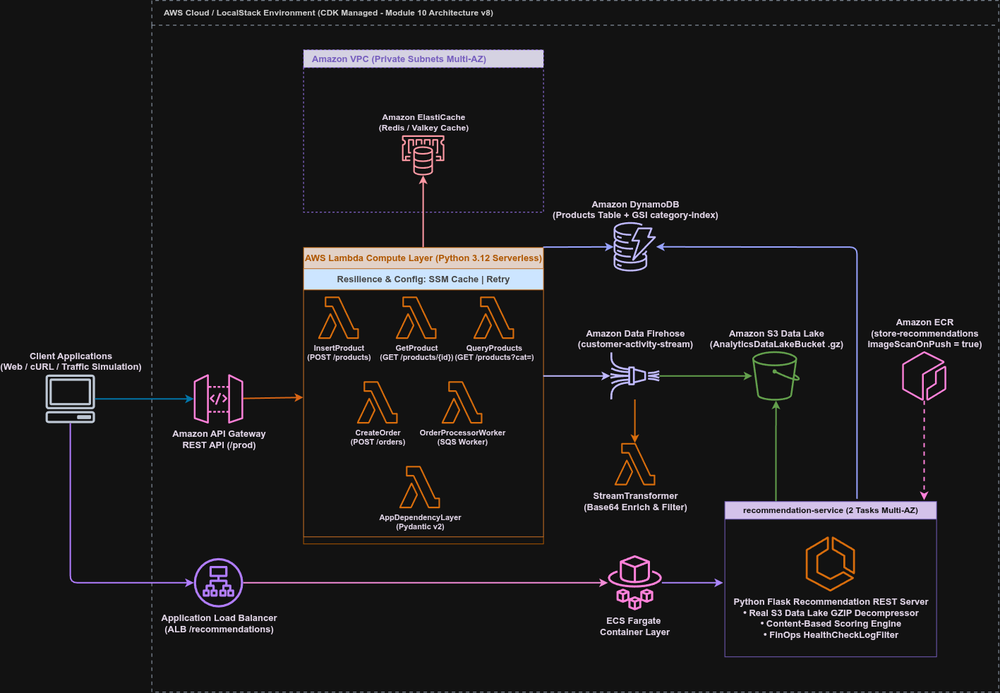

# Módulo 10 — Aplicações Containerizadas com Amazon ECS, AWS Fargate e Amazon ECR

## 🎯 Visão Geral e Objetivos do Módulo

Neste módulo, evoluímos a plataforma e-commerce de um modelo puramente Serverless para uma **arquitetura híbrida**, introduzindo a containerização de microsserviços de alto desempenho.

Implementamos o **Microsserviço de Recomendação Personalizado** em Python/Flask, empacotado em contêiner Docker e orquestrado no **Amazon ECS com AWS Fargate**, exposto por um **Application Load Balancer (ALB)** público em Alta Disponibilidade (Multi-AZ).

### Objetivos Alcançados:
1. **Containerização DevSecOps**: Criação de um `Dockerfile` otimizado em `python:3.12-slim`, rodando sob usuário não-root sem privilégios (`appuser` - regra SonarQube `docker:S6471`).
2. **Gestão de Imagens no Amazon ECR**: Registro privado `store-recommendations` com varredura automática de vulnerabilidades (`imageScanOnPush = true`) e política de retenção FinOps mantendo as 10 imagens mais recentes.
3. **Orquestração Serverless com AWS Fargate**: Provisionamento do cluster ECS `recommendations-cluster` com 2 tarefas ativas simultâneas (0.25 vCPU e 512 MB RAM cada) distribuídas entre subnets privadas em duas Zonas de Disponibilidade.
4. **Exposição via Load Balancer (ALB)**: Roteamento de tráfego na porta 80 para a porta 8000 do contêiner, com *Health Check* contínuo no endpoint `/health`.
5. **Análise de Data Lake em Tempo Real**: Leitura e descompactação de arquivos `.gz` gravados pelo Amazon Data Firehose no S3 Data Lake, cálculo dinâmico de pesos comportamentais (`product_view = 1.0`, `purchase = 3.0`) e consulta NoSQL otimizada no GSI `category-index` do Amazon DynamoDB.
6. **FinOps & Observabilidade**: Implementação do filtro `HealthCheckLogFilter` no Flask para suprimir logs de sucesso repetitivos de sondagem do ALB no CloudWatch, reduzindo a poluição e os custos de ingestão.

---

## 🏛️ Estado Atual da Plataforma (Visão Integrada de 10 Módulos)

A plataforma e-commerce atinge o seguinte estado funcional integrado:


---

## 🛠️ Detalhes de Implementação dos Componentes

### 1. `container_code/Dockerfile`
```dockerfile
FROM python:3.12-slim

WORKDIR /app

ENV PYTHONDONTWRITEBYTECODE=1
ENV PYTHONUNBUFFERED=1

COPY requirements.txt .
RUN pip install --no-cache-dir -r requirements.txt

# DevSecOps (docker:S6470): Cópia explícita de arquivos essenciais
COPY recommendation_service.py .

# DevSecOps (docker:S6471): Criação de usuário não-root sem privilégios
RUN useradd -m -u 1000 appuser && chown -R appuser:appuser /app
USER appuser

EXPOSE 8000

CMD ["python", "recommendation_service.py"]
```

---

### 2. `container_code/recommendation_service.py`
- **`/health`**: Endpoint de checagem de saúde utilizado pelo ALB, retornando `HTTP 200 {"status": "healthy"}`.
- **`/recommendations/<user_id>`**:
    1. Varre os objetos do S3 Data Lake (`analytics/customer-activity/`) utilizando o **Boto3 Paginator** (`s3_client.get_paginator('list_objects_v2')` - regra `python:S7622`).
    2. Descompacta fluxos GZIP `.gz` em memória RAM via `gzip.decompress()`.
    3. Soma os pesos de engajamento do usuário por categoria (`product_view = 1.0`, `purchase = 3.0`).
    4. Identifica a categoria de maior preferência do usuário (ex: `Accessories` para Geralt, `Home` para Yennefer).
    5. Consulta o DynamoDB via GSI `category-index` (`table.query(IndexName="category-index", KeyConditionExpression=Key("category").eq(...))`), reduzindo o consumo de RCUs em ~90%.
    6. Computa o score de similaridade por conteúdo (`0.85 + min(peso * 0.02, 0.14)`), ordena em ordem decrescente e retorna os Top 5 produtos recomendados.

---

### 3. `src/main/java/com/petreca/ProductApiStack.java` (Java 21 CDK IaC)
- **Repositório ECR (`store-recommendations`)**: Criado com `imageScanOnPush(true)`, mutabilidade de tags e regra de ciclo de vida mantendo as 10 imagens mais recentes.
- **Ativo Docker (`DockerImageAsset`)**: Empacotamento do diretório `container_code/` e integração nativa via `ContainerImage.fromDockerImageAsset()`.
- **Serviço Fargate (`ApplicationLoadBalancedFargateService`)**:
    - CPU: 256 (0.25 vCPU), Memória: 512 MiB por tarefa.
    - `desiredCount`: 2 tarefas ativas em Alta Disponibilidade (Multi-AZ).
    - Injeção das variáveis de ambiente `PRODUCTS_TABLE_NAME`, `CATEGORY_GSI_NAME` e `ANALYTICS_BUCKET_NAME`.
    - Concessão de permissões IAM de leitura no DynamoDB e no Bucket Analítico do S3 via `taskRole`.
    - Log Group padronizado em `/aws/ecs/store-recommendations` com `RemovalPolicy.DESTROY`.

---

## 🧪 Suíte de Testes e Validação

### Testes Automatizados Locais
- **Pytest (Runtime Python 3.12)**: `pytest lambda_code/tests/unit/ -v`
    - **59 testes aprovados** (100% de cobertura nos handlers, repositórios, serviços e rotas do contêiner).
- **JUnit 5 / Gradle (IaC Java 21 CDK)**: `./gradlew clean test`
    - **19 testes de infraestrutura aprovados** (Validação da síntese do ECR, ECS Cluster, Fargate Task Definition, Service e ALB Target Group).

### Script de Simulação de Tráfego (`scripts/simulate_ecommerce_traffic.py`)
- Semeia 50 produtos no catálogo com estoque inicial de 50 unidades cada.
- Simula tráfego de navegação para `user_geralt` (Acessórios) e `user_yennefer` (Poções/Home).
- Executa checkout real via `POST /orders`, disparando a cadeia EventBridge -> SQS -> Worker -> SNS -> Firehose.
- Aguarda o buffer de 60 segundos do Firehose gravar os arquivos `.gz` no S3 Data Lake.
- Consulta os endpoints `/recommendations/user_geralt` e `/recommendations/user_yennefer` no Fargate ALB, validando o retorno de categorias e recomendação de produtos com scores personalizados.

---

## 📄 Arquivos de Referência e Decisão
- [ADR 0008: Containerização do Microsserviço de Recomendação com Amazon ECS, AWS Fargate e Amazon ECR](../../adr/0008-containerized-applications-with-ecs-fargate-and-ecr.md)